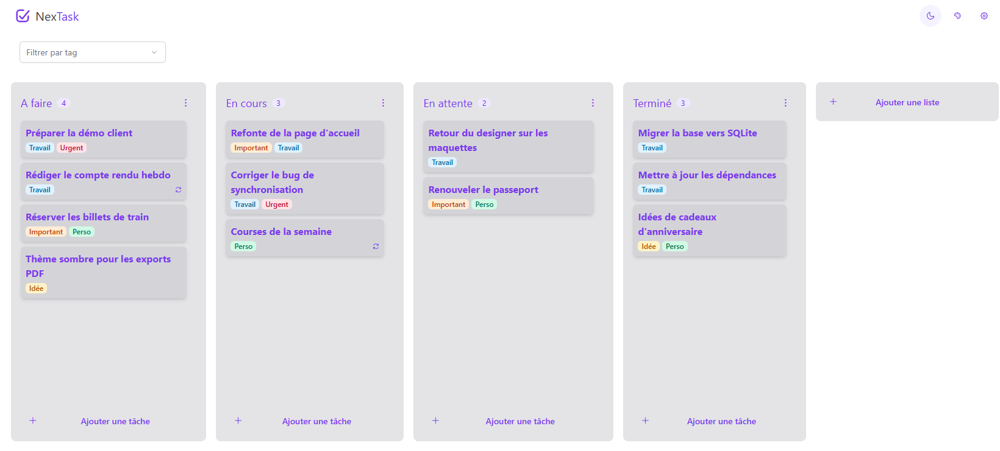
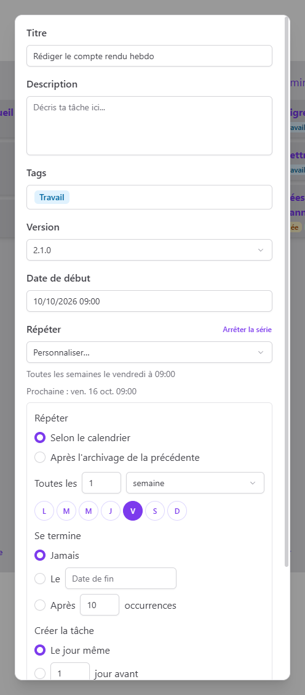

# NexTask — Kanban Todo List Desktop App

> A fast, offline Kanban todo list and task manager for the desktop, built with Electron, Vue 3, Prisma and SQLite.

[](https://github.com/Daarunia/NexTask/releases/latest)
[](LICENSE)

**NexTask** is a free, open-source **desktop todo app** that organizes your tasks on a **Kanban board**. Everything is stored locally in a SQLite database: no account, no cloud, no tracking. It is designed to stay out of your way, with a global quick-add shortcut, recurring tasks, reminders and a tray icon.

<p align="center">
  <picture>
    <source media="(prefers-color-scheme: dark)" srcset="docs/screenshots/board-dark.png">
    
  </picture>
</p>

## Download

Grab the latest Windows installer (`NexTask.Setup.x.y.z.exe`) or portable zip from the [**Releases page**](https://github.com/Daarunia/NexTask/releases/latest).

macOS and Linux builds can be produced from source (see [Build](#build)).

## Features



- **Kanban board** with customizable columns (stages) and drag-and-drop to reorder tasks and columns.
- **Quick add from anywhere** with a global shortcut (`Ctrl+Alt+N` / `Cmd+Alt+N`), even when the window is hidden.
- **Recurring tasks** (daily, weekly, monthly, yearly) with flexible rules: specific weekdays, nth weekday of the month, end date or occurrence count, pause and resume.
- **Reminders** through native desktop notifications based on each task's start date.
- **Tags** with a color palette to categorize and filter tasks.
- **Task versions** to group tasks by release or milestone.
- **Archives** for completed tasks, with optional automatic purge after 30, 90 or 365 days.
- **Undo** for destructive actions.
- **Automatic daily backups** of the database (the last 7 are kept).
- **JSON import / export** of all your data.
- **Light, dark or system theme**, custom accent color and adjustable interface scale.
- **Available in English, French, Spanish, Portuguese and Simplified Chinese**, following the system language or chosen in the settings.
- **System integration**: minimize to tray, launch at startup, remembers window size and position.
- **100% offline and private**: your data never leaves your computer.

The interface is currently available in French.

<br clear="right">

## Tech stack

| Layer    | Technologies                                         |
| -------- | ---------------------------------------------------- |
| Desktop  | Electron, electron-builder                           |
| Frontend | Vue 3, Pinia, PrimeVue, vue-i18n, TailwindCSS, Vite  |
| Backend  | Fastify (embedded local API), Prisma ORM, SQLite     |
| Testing  | Playwright end-to-end tests driving the Electron app |

## Getting started (development)

### Prerequisites

- **Node.js** 24 or later
- **npm** 12 or later

### Install and run

```bash
git clone https://github.com/Daarunia/NexTask
cd NexTask
npm install
npm run dev
```

`npm run dev` starts Vite and Electron together with hot reload.

### Build

```bash
npm run build:win    # Windows (NSIS installer + zip)
npm run build:mac    # macOS
npm run build:linux  # Linux (snap)
```

Packaged apps are written to the `dist/` folder.

### Tests

```bash
npm test
```

## License

Released under the [Apache 2.0 License](LICENSE). Third-party licenses are listed in [THIRD_PARTY_NOTICES.md](THIRD_PARTY_NOTICES.md).
